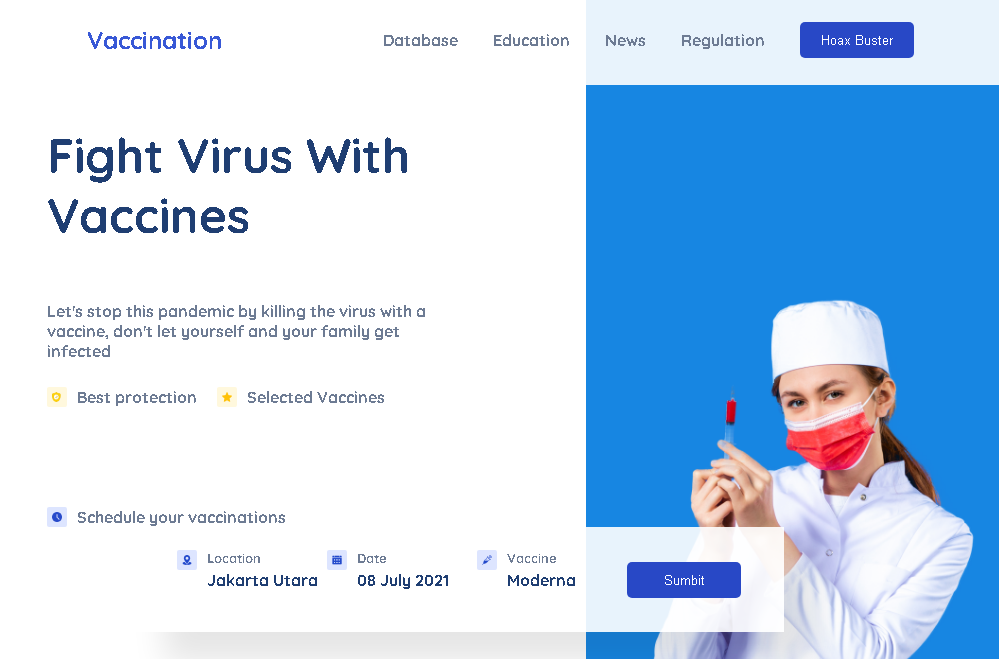

# Práctica-3-de-Intro-a-Frontend
 
## Vacunación

## Despiegue de la página

Para deplegar la página use github pages aqui esta el link para acceder a la misma.

Link : [Vaccine-page](https://cralpcode.github.io/Practica-3-de-Intro-a-Frontend/ "Practica-3")
